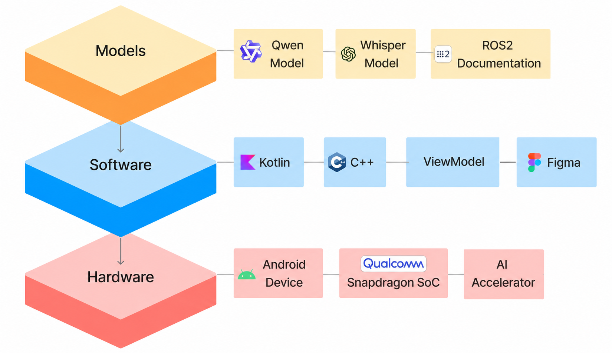

<div align="center">
  

  <h3>Ursa</h3>
  <p><strong>From Speech to Action: Voice Enabled Rover Control App using Large Language Model</strong></p>

  <table align="center">
    <tr>
      <td></td>
      <td></td>
      <td></td>
    </tr>
  </table>
</div>

<details>
<summary><strong>Table of Contents</strong></summary>

- [About the Project](#about-the-project)
- [Demo](#demo)
- [Key Features](#key-features)
- [System Architecture](#system-architecture)
- [Technical Stack](#technical-stack)
- [Getting Started with the App](#getting-started-with-the-app)
- [Attribution](#attribution)
- [License](#license)

</details>

## About the Project

Ursa is an Android application that converts natural language user commands into machine code instructions for robotic control, leveraging an on-device large language model (LLM). This project currently employs **Qwen 2.5-7B-Instruct** (previously LLaMA 3.2-3B) and integrates Qualcomm’s [Chat App Demo](https://github.com/quic/ai-hub-apps/tree/main/android/ChatApp). Sponsored by **Qualcomm**.

## Demo

[](https://youtu.be/QfCmIGPUlbI)

## Key Features
- Natural language to ROS2 code translation using Qwen 2.5-7B-Instruct and Whisper-tiny.en
- On-device model inference with Qualcomm Genie runtime and QAI Hub binaries
- Support for both manual control and real-time voice input
- Real-time telemetry, video streaming, and occupancy map display
- Fully offline operation; secure, responsive, and mobile-optimized

## System Architecture

```plaintext
[ Android UI: Voice/Text Input ]
               ↓
[ Whisper Model (STT) ]
               ↓
[ Qwen 2.5-7B-Instruct Inference (Genie Runtime) ]
               ↓
[ ROS2 Code Generation ]
               ↓
[ Rover Communication Layer ]
```

## Technical Stack



**Frontend**: Kotlin/Java (Android Studio)  
**Backend**:  
- Whisper-tiny.en (speech-to-text)  
- Qwen 2.5-7B-Instruct (natural language to code generation)  
- Qualcomm Genie runtime for inference

**Hardware**: Qualcomm Snapdragon 8 Elite / 8 Gen 3 / 8 Gen 2


## Getting Started with the App

See **[BUILD_GUIDE.md](BUILD_GUIDE.md)** for complete instructions covering:
- Prerequisites (JDK 17, QNN SDK)
- Building the APK — **debug** flavor (fast iteration, per-PC signing) and **release** flavor (stable signing for distribution)
- First-launch auto-download of model weights (~4.8 GB over Wi-Fi)
- Troubleshooting, performance tuning, swapping the LLM, publishing a new model release

### Quick start — just want to use the app?

If you have a supported phone (Snapdragon 8 Gen 2 / Gen 3 / Elite) and **don't want to set up a build environment**, request access from the maintainers to the **private release repo** and grab the latest APK:

> **APK distribution:** [github.com/AlexNtFound/HitchPlay-releases](https://github.com/AlexNtFound/HitchPlay-releases/releases) *(private — contact a maintainer for an invite)*

The release page is private because the APK contains Qualcomm-licensed runtime binaries that we shouldn't redistribute to people who haven't accepted Qualcomm's EULA. Once you're invited:

1. Download the latest `Ursa-vX.Y.Z.apk` from the [releases page](https://github.com/AlexNtFound/HitchPlay-releases/releases) (e.g. [v0.1.0](https://github.com/AlexNtFound/HitchPlay-releases/releases/tag/app-v0.1.0)).
2. Install Android platform-tools on your PC if you don't already have `adb` ([download](https://developer.android.com/tools/releases/platform-tools)).
3. On the phone: enable Developer Options + USB debugging.
4. Run:
   ```
   adb install -r Ursa-v0.1.0.apk
   adb shell am start -n com.quicinc.chatapp/com.chatgptlite.wanted.MainActivity
   ```

The app downloads ~4.8 GB of model weights automatically over Wi-Fi on first launch (~3 minutes on fast home Wi-Fi). After that it works fully offline. You don't need JDK, QNN SDK, Gradle, or any source code — `adb` is the only host-side dependency.

### Quick start — want to build it yourself?

1. Install **JDK 17** ([adoptium.net](https://adoptium.net/temurin/releases/?version=17)) and the **QNN SDK 2.42.0** ([qpm.qualcomm.com](https://qpm.qualcomm.com)).
2. Point Gradle at the QNN SDK by adding `qnn.sdk.dir=...` to `android/local.properties`.
3. From the [model release page](https://github.com/AlexNtFound/HitchPlay/releases/tag/model-qwen2_5_7b_instruct-v1), download four files:
   - `tokenizer.json` and `genie-config.json` → `android/ChatApp/src/main/assets/models/qwen2_5_7b_instruct/`
   - `whisper-tiny-en.tflite` and `whisper-tiny.tflite` → `android/ChatApp/src/main/assets/`
4. From `android/`, run **`.\build.cmd assembleDebug`** (Windows) or **`./build.sh assembleDebug`** (Linux), then `adb install -r` the resulting APK.

For the release flavor (proper signing, cross-PC updates, what you'd hand to a teammate), substitute `assembleRelease` and set up the project keystore as described in BUILD_GUIDE. The build commands are identical; only the signing setup differs.

## Attribution

Portions of the codebase and documentation are adapted from the Qualcomm Chat App Demo, 
including the Llama wrapper and Genie runtime integration guides. 
Modifications have been made to align with the project’s natural language to machine code 
conversion goals.

All original Qualcomm copyrights and license terms apply.

## LICENSE

This project includes licensed components from Qualcomm Technologies, Inc. Qualcomm® AI Hub Apps is licensed under BSD-3. See the [LICENSE file](../LICENSE).
